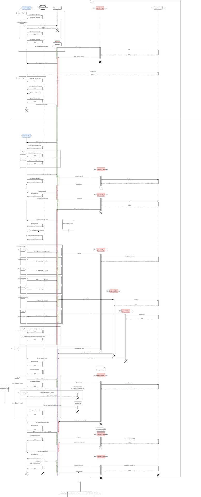

# Kranten import mule

This project glues together the microservices that can create a <pid>.complex. It can be
initialized by placing a message on its trigger queue. This message should contain the
pid, the directory to turn into a `.complex` file and the metadata that should be placed
in the mets file (see mets-listener in node microservices).

To function properly the mule flows use a database to keep track of information on a
specific directory. The table that it uses can be created with

```sql
CREATE TABLE tracktable (
	pid character(50) NOT NULL,
	status character(100),
	data text,
	nr_of_moves integer,
	nr_of_moved integer DEFAULT 0
);
```
## Usage
Place a message on the ingestrequests queue.

example:
```json
{
	"amount": 1,
	"basedir": "/path/to/directory",
	"createOriginalZip": false
}
```


You can restart the generation of a mets file by placing a message on the recover queue.
This message should contain the pid of a partially generated complex file.

example:

```json
{
	"pid": "4746q1wv0v"
}
```

The `_complex` directory will then be removed, and the generation starts from scratch.

## Sensor checks
The application checks the sensors defined in the `sensor.ids` property in order. For every sensor that exists in this list, there needs to be a maximum value defined.
Example:
```
sensor.ids=22348,23029
sensor.22348.maxvalue=20
sensor.23029.maxvalue=50
```

Before delivering a .complex file, all sensors are checked and compared with their maximum value. If the maximum value is exceeded, the code polls checks these sensors every 5 minutes and does not deliver the file as long as the sensor values exceed their maximums.

# Sequence diagram
